# Accountant

### 产品介绍
本人是一个在外留子，和室友合租时产生了很多共同消费，但是在国外转账不便的情况下，决定记账之后每月底结算。在平时记账敲计算器的时候觉得是逻辑很简单的任务，完全可以写成一个小工具，于是就写了这个项目。

产品的主要功能是对有共同消费的账单进行分账和记录，然后可以对每月的账单进行金额汇总，并给出转账建议。

### 架构

一个 Spring Boot + Mybatis-Plus + Vue 的Web项目。

### 仓库介绍

本仓库是Accountant项目的前端程序仓库。

后端仓库指路: [AccountantServer: 记账小工具](https://gitee.com/abc15879/accountant-server)

### 安装教程

本着开箱即用的原则，把运行环境和程序一起打包制作了发行版。

安装使用只需三步：

1. 下载发行版，链接：[Accountant 发行版 - Gitee.com](https://gitee.com/abc15879/accountant/releases)
2. 解压到本地
3. 双击start.bat运行

双击start.bat后会弹出一个cmd，看到如下界面表示程序正常启动，程序在运行后会自动打开默认浏览器访问localhost:5174，之后就可以开始使用了。如果没有自动打开，可以自行复制路径到浏览器中访问。使用完后在Command区域输入"stop"就能关闭所有服务。

### 使用说明

产品的主要由以下几个页面组成：分组管理页面、用户管理页面、主页、收据管理页面、月度结算页面。

#### 分组页面

产品以分组为前提，用户可将不同消费群组独立管理，互不干扰。也因此必须先创建分组和用户之后才能开始记账。

##### 新建分组

点击新建按钮，填充信息以新建分组。

##### 分组查看

使用搜索栏可以对分组进行查询，可以点击分组条目查看详细信息，并进行更新、删除等操作。需要注意的是如果分组中已经存在用户，必须将用户删除才能删除分组。

#### 用户页面

和分组页面功能类似，用于新建和管理用户。可以通过搜索栏进行查询，使用筛选框筛选特定分组的用户。同样的，删除用户在用户已经被记录进某条收据后是不被允许的，需要先删除所有有关该用户的收据才能删除。

##### 新增用户

可以在分组搜索栏根据分组名和描述进行查询，方便你找到要添加用户的分组。

##### 分组筛选

使用筛选按钮筛选特定分组的用户。

#### 主页

记账页面。

##### 记账流程

先选择账单所属的分组，选择完后会自动加载分组中的所有用户。

之后填写账单描述（店名、用途等标识）、消费时间，选择付款人。

之后可以一项一项输入单价，点击用户标签决定这个单价会由哪些用户承担。

比如说在这次消费中有单价20元的物品是由1、2、3、4一起买的，就可以选选择这些标签，使用“增量分配”按钮把帐分到这四人头上。同理“减量分配”是为了有时候一个账单只有少数几个物品不是所有人一起买的，可以减去后再增量分配到几个用户上。另外也可以手动输入每个用户的配额。

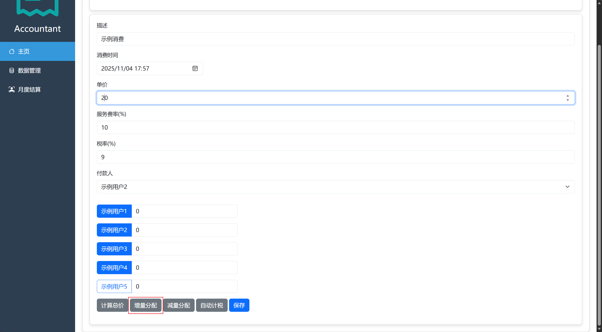

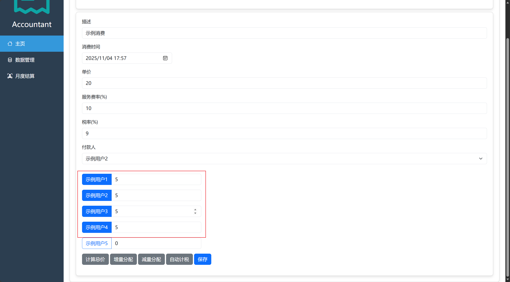

由于国外账单会有税钱和服务费，通常是按比率分配，所以也做了计税功能，选取需要计税标签，修改税率和服务费率再点击“自动计税”就可以了。

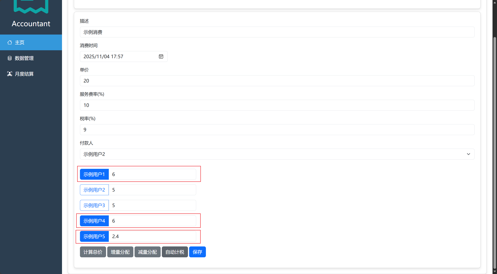

在计算完每个人的配额后可以点击“计算总价”按钮，会把总价显示在“单价”框里，可以检查总价对不对得上。之后就可以点击“保存”按钮来保存账单。

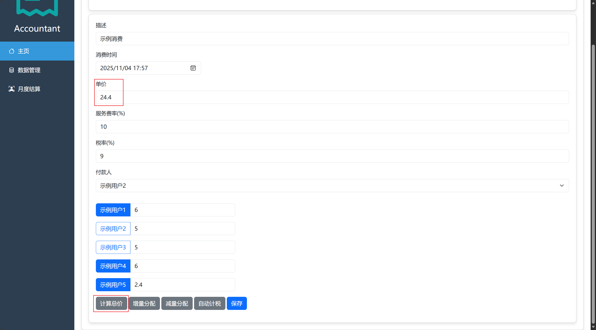

#### 账单页面

和用户页面和分组页面类似。选择分组之后可以查看该分组下的账单，同样可以使用搜索栏模糊查询。点击条目可以编辑和删除。

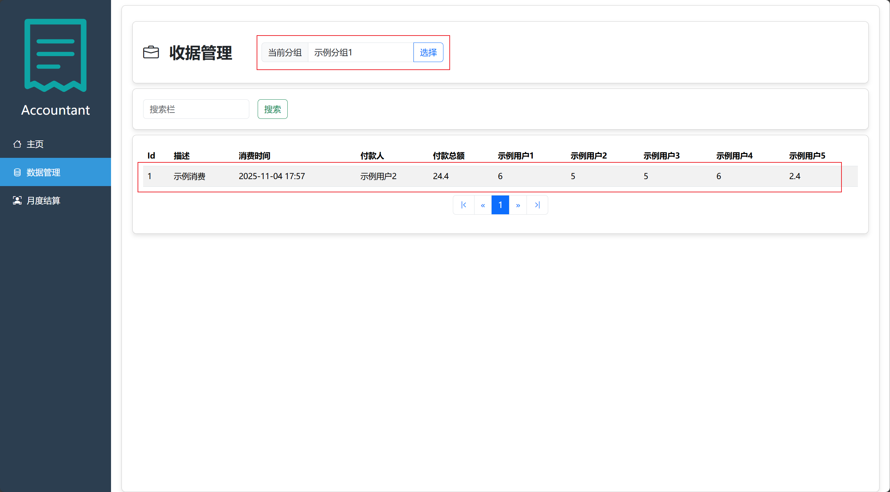

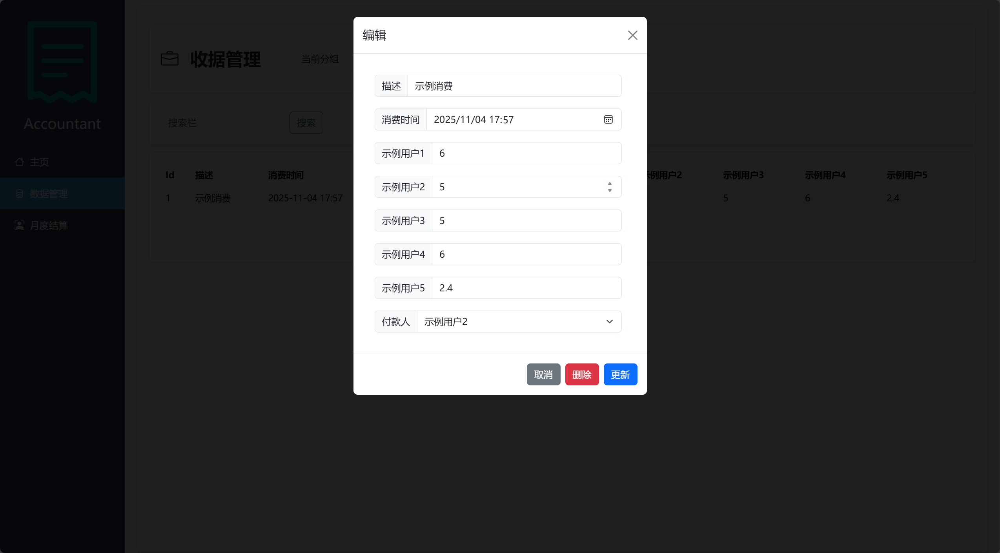

#### 结算页面

用于展示月度结算情况，进入后点击“选择”按钮选择月份和分组，确认后就可以看到收支情况和转账建议。

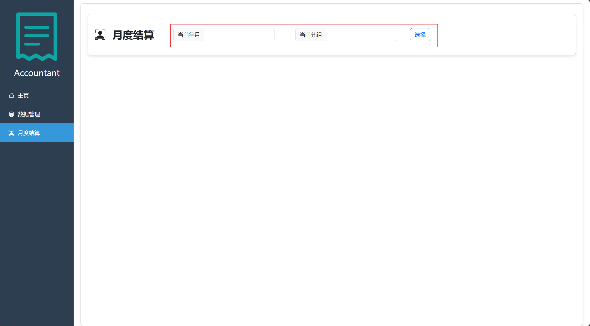

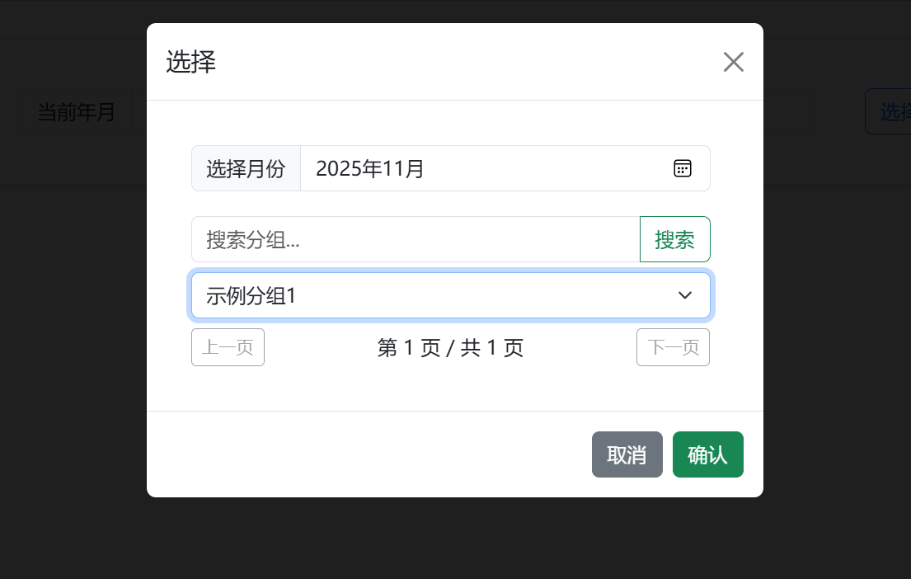

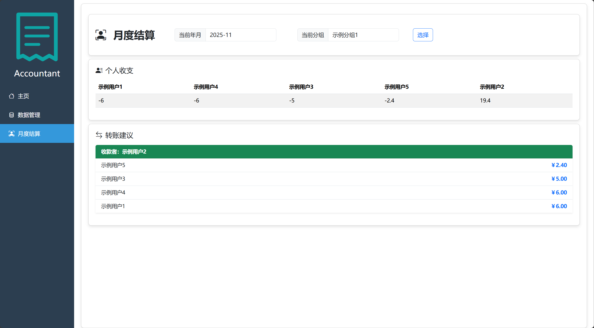

### 其他配置

本项目为了支持开箱即用，默认使用Sqlite作为数据库，数据文件是data\sqlite\accountant，相关配置在\config\application-sqlite.yml文件中，Sqlite的建表脚本存放在data\sqlite\SQL路径下，可以自行配置数据文件的路径。

同时也做了面向Mysql的支持，可以通过修改发行版config目录下的application.yml文件来切换到mysql配置，并修改application-mysql.yml来配置自己的数据源。Mysql的建表脚本存放在\data\mysql\SQL和data\sqlite\SQL路径下。

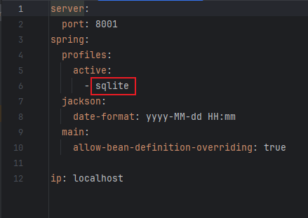

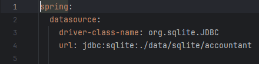

